# TB ERP System - Architecture & System Design Diagrams

> **Document Purpose**: Production-grade architecture diagrams for initial stakeholder approval  
> **Architecture Style**: Microservices with Backend-for-Frontend (BFF) Pattern  
> **Technology Stack**: Next.js (Frontend/BFF) | Python FastAPI (Backend) | PostgreSQL (Persistence)

---

## 1. High-Level System Architecture

This diagram shows the complete ERP ecosystem from client to data layer.


---

## 2. Database-per-Service Architecture (Schema Isolation)

Shows how each microservice owns its data with logical schema separation.


> [!IMPORTANT]
> **No Foreign Keys Across Schemas**: Cross-service references use soft IDs (e.g., `assigned_employee_id` in Assets). Consistency is maintained via event-driven updates.

---

## 3. Backend-for-Frontend (BFF) Pattern

Detailed view of how Next.js orchestrates requests to backend services.


---

## 4. Monorepo Project Structure

Recommended folder organization using Turborepo.

```mermaid
flowchart LR
    subgraph REPO["📁 tb-erp-system (Monorepo)"]
        direction TB
        
        subgraph APPS["apps/"]
            WEB["📱 web-frontend/<br/>(Next.js)"]
            ASSET["🔧 asset-service/<br/>(Python FastAPI)"]
            INVOICE["📄 invoice-service/<br/>(Python FastAPI)"]
            EMPLOYEE["👤 employee-service/<br/>(Python FastAPI)"]
        end
        
        subgraph PACKAGES["packages/"]
            UI["🎨 ui/<br/>(Shared Components)"]
            TS_CONFIG["⚙️ ts-config/"]
            ESLINT["📏 eslint-config/"]
            SHARED["📦 shared/<br/>(Types, Utils)"]
        end
        
        subgraph INFRA["infrastructure/"]
            DOCKER["🐳 docker-compose.yml"]
            K8S["☸️ kubernetes/"]
            TERRAFORM["🏗️ terraform/"]
        end
        
        subgraph ROOT_FILES["Root Config"]
            TURBO["turbo.json"]
            PACKAGE["package.json"]
            README["README.md"]
        end
    end

    style APPS fill:#E8F5E9,stroke:#2E7D32
    style PACKAGES fill:#E3F2FD,stroke:#1565C0
    style INFRA fill:#FFF3E0,stroke:#EF6C00
    style ROOT_FILES fill:#F5F5F5,stroke:#616161
```



### Service Directory Standard (Python FastAPI)

```
apps/asset-service/
├── app/
│   ├── api/
│   │   └── v1/
│   │       └── endpoints/
│   │           ├── assets.py
│   │           └── maintenance.py
│   ├── core/           # Configuration
│   ├── db/             # Database connection
│   ├── models/         # SQLAlchemy models
│   ├── schemas/        # Pydantic schemas
│   └── main.py         # FastAPI entrypoint
├── alembic/            # DB migrations
├── tests/              # Pytest suite
├── Dockerfile
└── requirements.txt
```

---

## 5. Container & Infrastructure Architecture

Docker container orchestration and networking.


> [!NOTE]
> **Network Isolation**: Backend services are NOT exposed to public internet. Only the Next.js BFF receives external traffic.

---

## 6. Security & Authentication Flow

JWT-based stateless authentication across the distributed system.


### Role-Based Access Control Matrix

| Role | Asset Service | Invoice Service | Employee Service |
|:-----|:-------------:|:---------------:|:----------------:|
| `admin` | ✅ Full | ✅ Full | ✅ Full |
| `asset_manager` | ✅ Full | ❌ None | 👁️ Read |
| `accountant` | 👁️ Read | ✅ Full | 👁️ Read |
| `hr_manager` | 👁️ Read | 👁️ Read | ✅ Full |
| `employee` | 👁️ Own | 👁️ Own | 👁️ Own |

---

## 7. API Composition & Data Flow

How distributed data is aggregated for unified views.

```mermaid
flowchart LR
    subgraph REQUEST["📥 Client Request"]
        REQ["GET /dashboard/assets-with-owners"]
    end

    subgraph BFF["🔀 Next.js BFF (Composition Layer)"]
        HANDLER["API Route Handler"]
        
        subgraph PARALLEL["Parallel Fetch"]
            CALL1["Fetch Assets"]
            CALL2["Fetch Employees"]
        end
        
        MERGE["Data Merger"]
    end

    subgraph SERVICES["⚙️ Microservices"]
        ASSET_SVC["Asset Service"]
        EMP_SVC["Employee Service"]
    end

    subgraph DBS["💾 Databases"]
        A_DB[("asset_db")]
        E_DB[("employee_db")]
    end

    subgraph RESPONSE["📤 Unified Response"]
        JSON["Enriched JSON"]
    end

    REQ --> HANDLER
    HANDLER --> CALL1
    HANDLER --> CALL2
    CALL1 --> ASSET_SVC
    CALL2 --> EMP_SVC
    ASSET_SVC --> A_DB
    EMP_SVC --> E_DB
    A_DB --> ASSET_SVC
    E_DB --> EMP_SVC
    ASSET_SVC --> MERGE
    EMP_SVC --> MERGE
    MERGE --> JSON

    style REQUEST fill:#E3F2FD,stroke:#1565C0
    style BFF fill:#E8F5E9,stroke:#2E7D32
    style SERVICES fill:#FFF3E0,stroke:#EF6C00
    style DBS fill:#FCE4EC,stroke:#C2185B
    style RESPONSE fill:#F3E5F5,stroke:#7B1FA2
```



### Composition Algorithm

```plaintext
1. Receive request for enriched asset list
2. Call Asset Service → Get assets with employee_ids
3. Extract unique employee_ids: [1, 5, 12, 23]
4. Call Employee Service with batch endpoint: GET /employees?ids=1,5,12,23
5. Create lookup map: { 1: "John", 5: "Jane", ... }
6. Merge employee names into asset objects
7. Return unified response to client
```

---

## 8. CI/CD Pipeline Architecture

Independent deployment pipelines per service.


> [!TIP]
> **Independent Deployability**: Asset team can hotfix their service without waiting for Invoice team's testing cycle.

---

## 9. Event-Driven Architecture (Optional Enhancement)

For cross-service consistency and real-time updates.


### Event Scenarios

| Event | Producer | Consumer(s) | Action |
|:------|:---------|:------------|:-------|
| `employee.deleted` | Employee Service | Asset Service | Nullify `assigned_employee_id` |
| `asset.created` | Asset Service | Dashboard Service | Update total asset value |
| `invoice.paid` | Invoice Service | Dashboard, Notification | Update revenue, send receipt |

---

## 10. Technology Stack Summary


---

## 11. Deployment Architecture

Production infrastructure layout.

```mermaid
flowchart TB
    subgraph CLOUD["☁️ Cloud Provider (Azure/AWS/GCP)"]
        subgraph CDN_LAYER["CDN & Edge"]
            CDN["CDN (CloudFront/Vercel Edge)"]
        end
        
        subgraph COMPUTE["Compute Layer"]
            subgraph K8S["Kubernetes Cluster"]
                subgraph FRONTEND_PODS["Frontend Pods"]
                    WEB1["Next.js Pod 1"]
                    WEB2["Next.js Pod 2"]
                end
                
                subgraph BACKEND_PODS["Backend Pods"]
                    ASSET_POD["Asset Service Pod"]
                    INVOICE_POD["Invoice Service Pod"]
                    EMPLOYEE_POD["Employee Service Pod"]
                end
            end
        end
        
        subgraph DATA_LAYER["Managed Data Services"]
            PG_PRIMARY["PostgreSQL Primary"]
            PG_REPLICA["PostgreSQL Read Replica"]
            REDIS_MANAGED["Redis Cluster"]
        end
        
        subgraph MONITORING["Observability"]
            LOG_AGG["Log Aggregator"]
            METRICS["Metrics Server"]
            TRACES["Distributed Traces"]
        end
    end

    subgraph USERS["Global Users"]
        USER1["👤 User (Region 1)"]
        USER2["👤 User (Region 2)"]
    end

    USER1 --> CDN
    USER2 --> CDN
    CDN --> WEB1
    CDN --> WEB2
    WEB1 --> ASSET_POD
    WEB1 --> INVOICE_POD
    WEB1 --> EMPLOYEE_POD
    WEB2 --> ASSET_POD
    WEB2 --> INVOICE_POD
    WEB2 --> EMPLOYEE_POD
    ASSET_POD --> PG_PRIMARY
    INVOICE_POD --> PG_PRIMARY
    EMPLOYEE_POD --> PG_PRIMARY
    ASSET_POD -.-> PG_REPLICA
    INVOICE_POD -.-> PG_REPLICA
    EMPLOYEE_POD -.-> PG_REPLICA
    ASSET_POD --> REDIS_MANAGED
    INVOICE_POD --> REDIS_MANAGED
    EMPLOYEE_POD --> REDIS_MANAGED

    style CDN_LAYER fill:#FFECB3,stroke:#FF8F00
    style COMPUTE fill:#E3F2FD,stroke:#1565C0
    style DATA_LAYER fill:#FCE4EC,stroke:#C2185B
    style MONITORING fill:#E8F5E9,stroke:#2E7D32
```



---

## Appendix: Key Architectural Decisions

| Decision | Choice | Rationale |
|:---------|:-------|:----------|
| **Architecture Pattern** | Microservices + BFF | Independent scaling & development while maintaining unified UX |
| **Frontend Framework** | Next.js (App Router) | SSR, API Routes as BFF, React ecosystem |
| **Backend Framework** | Python FastAPI | High-performance async I/O, Pydantic validation, auto-docs |
| **Database Strategy** | Schema-per-Service | Logical isolation with cost efficiency |
| **Authentication** | NextAuth.js + JWT | Stateless, scalable identity propagation |
| **Repository Strategy** | Monorepo (Turborepo) | Simplified management, shared tooling |
| **Container Strategy** | Docker + Kubernetes | Consistent environments, horizontal scaling |
| **Communication** | REST (HTTP) + Events | Simple synchronous calls + eventual consistency |

---

> **Next Steps**: Upon approval, proceed with monorepo scaffolding and service skeleton implementation.
